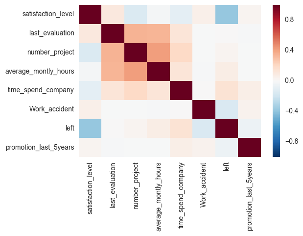
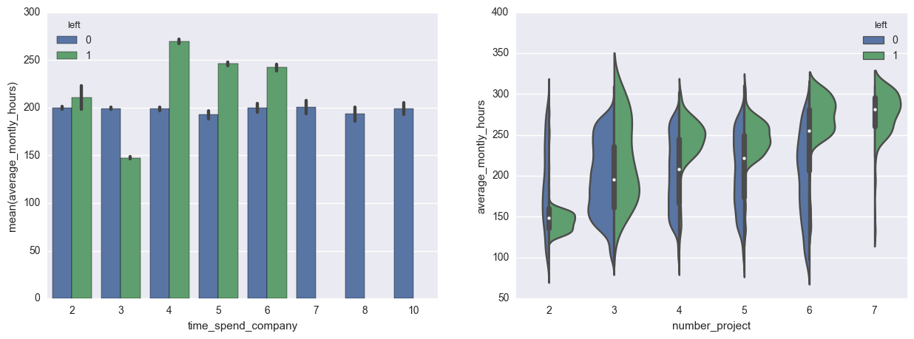
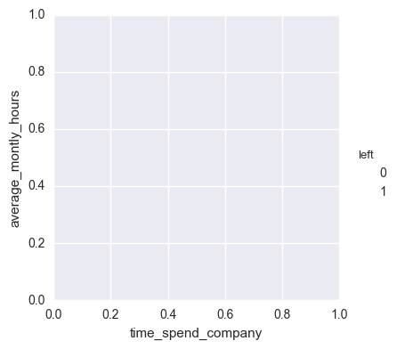
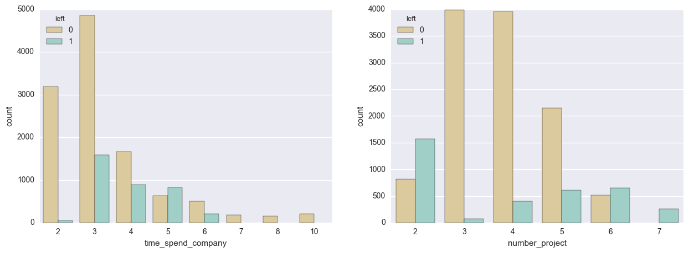
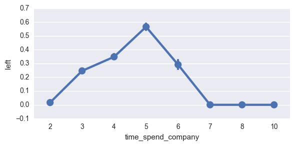
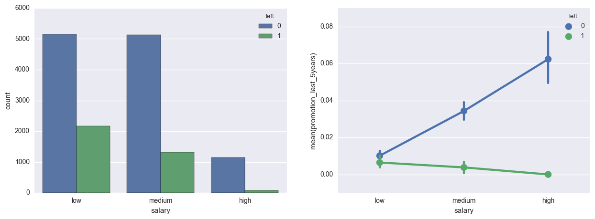
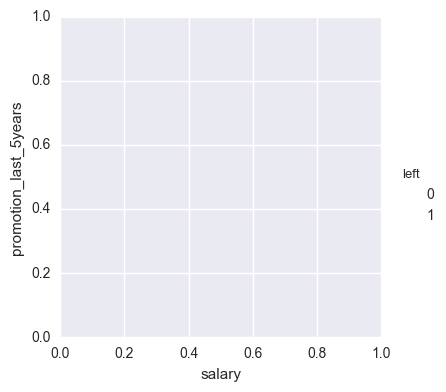
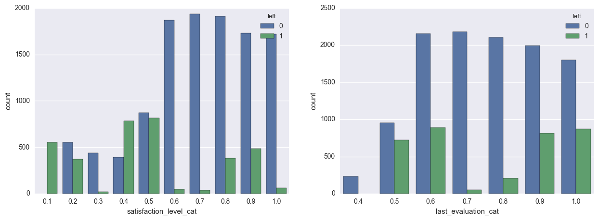
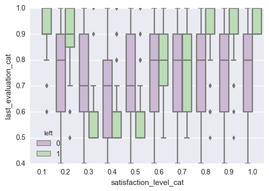

```python
import pandas as pd
import numpy as np
import matplotlib.pyplot as plt
import seaborn as sb
import math
from sklearn.model_selection import train_test_split
%matplotlib inline
```


```python
data=pd.read_csv('HR_comma_sep.csv')
```


```python
data.head()
```


<div>
<table border="1" class="dataframe">
  <thead>
    <tr style="text-align: right;">
      <th></th>
      <th>satisfaction_level</th>
      <th>last_evaluation</th>
      <th>number_project</th>
      <th>average_montly_hours</th>
      <th>time_spend_company</th>
      <th>Work_accident</th>
      <th>left</th>
      <th>promotion_last_5years</th>
      <th>sales</th>
      <th>salary</th>
    </tr>
  </thead>
  <tbody>
    <tr>
      <th>0</th>
      <td>0.38</td>
      <td>0.53</td>
      <td>2</td>
      <td>157</td>
      <td>3</td>
      <td>0</td>
      <td>1</td>
      <td>0</td>
      <td>sales</td>
      <td>low</td>
    </tr>
    <tr>
      <th>1</th>
      <td>0.80</td>
      <td>0.86</td>
      <td>5</td>
      <td>262</td>
      <td>6</td>
      <td>0</td>
      <td>1</td>
      <td>0</td>
      <td>sales</td>
      <td>medium</td>
    </tr>
    <tr>
      <th>2</th>
      <td>0.11</td>
      <td>0.88</td>
      <td>7</td>
      <td>272</td>
      <td>4</td>
      <td>0</td>
      <td>1</td>
      <td>0</td>
      <td>sales</td>
      <td>medium</td>
    </tr>
    <tr>
      <th>3</th>
      <td>0.72</td>
      <td>0.87</td>
      <td>5</td>
      <td>223</td>
      <td>5</td>
      <td>0</td>
      <td>1</td>
      <td>0</td>
      <td>sales</td>
      <td>low</td>
    </tr>
    <tr>
      <th>4</th>
      <td>0.37</td>
      <td>0.52</td>
      <td>2</td>
      <td>159</td>
      <td>3</td>
      <td>0</td>
      <td>1</td>
      <td>0</td>
      <td>sales</td>
      <td>low</td>
    </tr>
  </tbody>
</table>
</div>


# DATA EXPLORATION 


```python
print(data.describe())

print ('<---------------------------------->'+ '\n')
data.info()
```

           satisfaction_level  last_evaluation  number_project  \
    count        14999.000000     14999.000000    14999.000000   
    mean             0.612834         0.716102        3.803054   
    std              0.248631         0.171169        1.232592   
    min              0.090000         0.360000        2.000000   
    25%              0.440000         0.560000        3.000000   
    50%              0.640000         0.720000        4.000000   
    75%              0.820000         0.870000        5.000000   
    max              1.000000         1.000000        7.000000   
    
           average_montly_hours  time_spend_company  Work_accident          left  \
    count          14999.000000        14999.000000   14999.000000  14999.000000   
    mean             201.050337            3.498233       0.144610      0.238083   
    std               49.943099            1.460136       0.351719      0.425924   
    min               96.000000            2.000000       0.000000      0.000000   
    25%              156.000000            3.000000       0.000000      0.000000   
    50%              200.000000            3.000000       0.000000      0.000000   
    75%              245.000000            4.000000       0.000000      0.000000   
    max              310.000000           10.000000       1.000000      1.000000   
    
           promotion_last_5years  
    count           14999.000000  
    mean                0.021268  
    std                 0.144281  
    min                 0.000000  
    25%                 0.000000  
    50%                 0.000000  
    75%                 0.000000  
    max                 1.000000  
    <---------------------------------->
    
    <class 'pandas.core.frame.DataFrame'>
    RangeIndex: 14999 entries, 0 to 14998
    Data columns (total 10 columns):
    satisfaction_level       14999 non-null float64
    last_evaluation          14999 non-null float64
    number_project           14999 non-null int64
    average_montly_hours     14999 non-null int64
    time_spend_company       14999 non-null int64
    Work_accident            14999 non-null int64
    left                     14999 non-null int64
    promotion_last_5years    14999 non-null int64
    sales                    14999 non-null object
    salary                   14999 non-null object
    dtypes: float64(2), int64(6), object(2)
    memory usage: 1.1+ MB


On an average the satisfaction level amongst employs are around 61%, the last evaluation score they recieved is 71% and  are working on an average 4 projects at company.
Promotions are very rare and in our dataset 23% are such wh left the company.


```python
#studying categories
print (data['sales'].unique())
print (data['salary'].unique())
```

    ['sales' 'accounting' 'hr' 'technical' 'support' 'management' 'IT'
     'product_mng' 'marketing' 'RandD']
    ['low' 'medium' 'high']


```python
#Checking for missing data points
data.isnull().sum()
```


    satisfaction_level       0
    last_evaluation          0
    number_project           0
    average_montly_hours     0
    time_spend_company       0
    Work_accident            0
    left                     0
    promotion_last_5years    0
    sales                    0
    salary                   0
    dtype: int64


None found


```python
#Changing left and un;left into numerical data
data_left=data[data.left==1]
data_unleft=data[data.left==0]
data_left.head()
```


<div>
<table border="1" class="dataframe">
  <thead>
    <tr style="text-align: right;">
      <th></th>
      <th>satisfaction_level</th>
      <th>last_evaluation</th>
      <th>number_project</th>
      <th>average_montly_hours</th>
      <th>time_spend_company</th>
      <th>Work_accident</th>
      <th>left</th>
      <th>promotion_last_5years</th>
      <th>sales</th>
      <th>salary</th>
    </tr>
  </thead>
  <tbody>
    <tr>
      <th>0</th>
      <td>0.38</td>
      <td>0.53</td>
      <td>2</td>
      <td>157</td>
      <td>3</td>
      <td>0</td>
      <td>1</td>
      <td>0</td>
      <td>sales</td>
      <td>low</td>
    </tr>
    <tr>
      <th>1</th>
      <td>0.80</td>
      <td>0.86</td>
      <td>5</td>
      <td>262</td>
      <td>6</td>
      <td>0</td>
      <td>1</td>
      <td>0</td>
      <td>sales</td>
      <td>medium</td>
    </tr>
    <tr>
      <th>2</th>
      <td>0.11</td>
      <td>0.88</td>
      <td>7</td>
      <td>272</td>
      <td>4</td>
      <td>0</td>
      <td>1</td>
      <td>0</td>
      <td>sales</td>
      <td>medium</td>
    </tr>
    <tr>
      <th>3</th>
      <td>0.72</td>
      <td>0.87</td>
      <td>5</td>
      <td>223</td>
      <td>5</td>
      <td>0</td>
      <td>1</td>
      <td>0</td>
      <td>sales</td>
      <td>low</td>
    </tr>
    <tr>
      <th>4</th>
      <td>0.37</td>
      <td>0.52</td>
      <td>2</td>
      <td>159</td>
      <td>3</td>
      <td>0</td>
      <td>1</td>
      <td>0</td>
      <td>sales</td>
      <td>low</td>
    </tr>
  </tbody>
</table>
</div>


# Plots

Let's plot some variables and try to discover some insights from them an=bout the datset. 


```python
#Lets start by plotting correlation between the variables..

corr=data.corr()

sb.heatmap(corr, )
```


    <matplotlib.axes._subplots.AxesSubplot at 0x7f49e944ed50>





```python
fig, (axis1,axis2) = plt.subplots(1,2, figsize=(15,5))
sb.factorplot(x='time_spend_company', y='average_montly_hours', hue='left', data=data, kind='bar', ax=axis1)
sb.violinplot(x='number_project', y='average_montly_hours', hue='left', data=data, split=True, ax=axis2)
```


    <matplotlib.axes._subplots.AxesSubplot at 0x7f49e9a00d50>








1. Very clearly it can be seen that if working hours are more than 200 per month you are very much likely to loose your employ irrespective of any other factor.
2. Second plot is the relation between number of projects and working hours. Like already stated in the above statement, number of projects don't seem to have much impact on the employ compared to working hours.

# Some Count plots


```python
plt.figure(figsize=(15,5))

plt.subplot(1,2,1)
sb.countplot(x='time_spend_company', hue='left',data=data, palette="BrBG")
plt.subplot(1,2,2)
sb.countplot(x='number_project', hue='left',data=data, palette='BrBG')

sb.factorplot(x='time_spend_company', y='left', data=data, size=3, aspect=2)
```


    <seaborn.axisgrid.FacetGrid at 0x7f49ea697710>








1. Neither very new employs nor very old employs leave company. Probability of an employee leaving a company is more when he is somewhere in the range 3-6 years (from the third plot).
2. Probably number of projects increases burden on employs and they leave, keep projects assigned below 6. 


```python
f, (axis1,axis2)=plt.subplots(1,2, figsize=(15,5))
sb.countplot(x='salary', hue='left', data=data, ax=axis1)
#plt.subplot(1,2,2)
sb.factorplot(x='salary', y='promotion_last_5years', hue='left', data=data, ax=axis2, )
```


    <seaborn.axisgrid.FacetGrid at 0x7f49e92c52d0>








```python
#Converting the continous variables into categorial for better estimation in graphs
data['satisfaction_level_cat']=0
 
def tocategory(level):
    temp=math.ceil(level*10)
    level=temp/10
    return level

data['satisfaction_level_cat']=data[['satisfaction_level']].apply(tocategory, axis=1)
data['satisfaction_level_cat'].head()

data['last_evaluation_cat']=data[['last_evaluation']].apply(tocategory, axis=1)
data['last_evaluation_cat'].head()
```


    0    0.6
    1    0.9
    2    0.9
    3    0.9
    4    0.6
    Name: last_evaluation_cat, dtype: float64


```python
f, (axis1,axis2)=plt.subplots(1,2, figsize=(15,5))
sb.countplot(x="satisfaction_level_cat", hue="left", data=data,ax= axis1);
sb.countplot(x="last_evaluation_cat", hue="left", data=data,ax= axis2);

```





```python
plt.subplot(111)
sb.boxplot(x="satisfaction_level_cat", y="last_evaluation_cat", hue="left", data=data, palette="PRGn")

```


    <matplotlib.axes._subplots.AxesSubplot at 0x7f49e9138050>





```python
#Splitting in training and testing datasets
model_data=data.drop(labels=['satisfaction_level_cat', 'last_evaluation_cat', 'salary', 'sales'], axis=1)
train = model_data.sample(frac=0.8, random_state=1)
print (train.shape)
test = model_data.loc[~model_data.index.isin(train.index)]

'''
#convert string variables into int
def harmonize(data):
    data.loc[data['salary']=='low']=0
    data.loc[data['salary']=='medium']=1
    data.loc[data['salary']=='low']=2
    
    data.loc[data['sales']== s=findname()'''
```

    (11999, 8)


    "\n#convert string variables into int\ndef harmonize(data):\n    data.loc[data['salary']=='low']=0\n    data.loc[data['salary']=='medium']=1\n    data.loc[data['salary']=='low']=2\n    \n    data.loc[data['sales']== s=findname()"


```python

```


```python
# Import the random forest model.
from sklearn.ensemble import RandomForestClassifier
from sklearn.metrics import accuracy_score
from sklearn.metrics import f1_score

print (train.columns)

predictors=['satisfaction_level', 'last_evaluation', 'number_project',
       'average_montly_hours', 'time_spend_company', 'Work_accident', 'promotion_last_5years']

model = RandomForestClassifier(n_estimators=100, min_samples_leaf=10, random_state=1)
model.fit(train[predictors], train["left"])

predictions = model.predict(test[predictors])
accuracy_score(predictions, test['left'])
```

    Index([u'satisfaction_level', u'last_evaluation', u'number_project',
           u'average_montly_hours', u'time_spend_company', u'Work_accident',
           u'left', u'promotion_last_5years'],
          dtype='object')


    0.97733333333333339


```python

```
